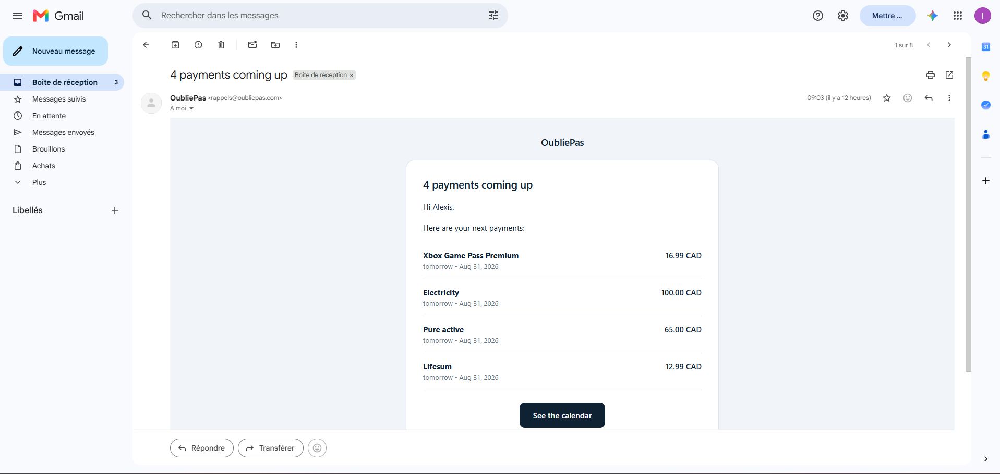

# OubliePas

A subscription and bill tracker. It answers one question: **what am I paying
for, and what is about to be charged?** Then it makes sure nobody has to go
looking for the answer.


## Contents

- [What it does](#what-it-does)
- [How it is built](#how-it-is-built)
- [The backend, in brief](#the-backend-in-brief)
- [The frontend, in brief](#the-frontend-in-brief)
- [Decisions worth naming](#decisions-worth-naming)
- [Tests](#tests)
- [Status](#status)
- [The two repositories](#the-two-repositories)

## What it does

### Two kinds of commitment

A **subscription** is a recurring service you signed up for. A **bill** is a
fixed cost you owe anyway. Same shape, different meaning, and the distinction
runs all the way down to the reminder wording.

Each line carries its category, its cadence, its own reminder lead time and both
the per-charge and yearly amounts, because a $16.99 monthly line reads very
differently as $203.88 a year.

An account tracks up to 25 of each kind. Only active and paused lines count
toward that, so archiving frees a slot while keeping the history. Deleting sends
a line to a trash it can come back from for thirty days.


### A calendar of instalments

Occurrences are **materialised rows, not computed on read**: a generator writes
them ahead of time, so a due date is a fact in the database rather than the
result of a calculation nobody can audit. Marking one paid takes one click, and
the app records both when you clicked and the day you say you actually paid.


On a phone the grid keeps its seven columns and drops the text. A day becomes a
square with coloured dots, and tapping it opens that day's instalments below the
grid. Seven columns of text are unreadable at 390 px; the shape of the month is
not.

### Where the money goes

Every category, not just the top five, and the two numbers that matter for a
decision: what you are committed to per year and per month. The heaviest lines
are ranked across both types together: rent at $8,400 a year and Netflix at
$262 belong on the same scale.


### Reminders that arrive

Three families of alert, each switchable on its own (**before the due date**,
**past due**, **trial end or cancellation notice**), over two channels, email and
web push, plus a weekly digest every Monday.




A job runs once a day. It purges what the trash has held long enough, generates
the occurrences that entered the horizon, then sends. Each reminder is keyed on
the instalment, the family and the channel, so it goes out exactly once, and a
failed send is left unmarked so the next run retries it.

Trial and cancellation deadlines are the third family, and the one people forget:
a free trial that ends in three days, or a contract that must be cancelled thirty
days before it renews. Both are computed from the commitment rather than stored,
so editing the dates moves the warning.

### An account, and what it holds

Sign up with an email and a password, or with Google. Either way the session is a
short-lived bearer token plus a refresh token in an httpOnly cookie, stored
hashed. Changing your address sends a code to the new one and keeps the old one
working until it is confirmed, so a typo cannot lock you out.

Everything is in French and English, light and dark, and follows your own time
zone. The last one matters more than it sounds: at 22:10 in Atlantic Canada it is
already tomorrow in UTC, and a dashboard that bounds the month in UTC shows you
next month while you are still in this one.

### Installable

The client is a progressive web app. It installs from the browser, runs in its
own window without an address bar, and stays readable without a connection. On an
iPhone it is the same gesture that unlocks push notifications, which Safari
refuses to offer inside a tab.

## How it is built

Two deployables from two repositories: a FastAPI service, [OubliePas-backend](https://github.com/AlexisIvan2000/OubliePas-backend),
and a React SPA, [OubliePas-frontend](https://github.com/AlexisIvan2000/OubliePas-frontend).

| | Backend | Frontend |
|---|---|---|
| Language | Python 3.13 | JavaScript |
| Framework | FastAPI + Starlette | React 19 |
| Build |  | Vite 8 |
| Data | PostgreSQL, SQLAlchemy 2 (async), asyncpg |  |
| Migrations | Alembic |  |
| Validation | Pydantic 2 |  |
| Auth | JWT + argon2, Google OAuth | React Router 7 |
| Email | Resend |  |
| Web push | py-vapid, http-ece, httpx | Service worker, Push API |
| Storage | S3-compatible, boto3, Pillow |  |
| Rate limiting | slowapi + Redis |  |
| Styling |  | CSS Modules |
| Tests | pytest | Vitest |
| Hosting | Railway | Vercel |

No TypeScript, no Tailwind, no UI component library, no state manager, no
data-fetching library. The backend lists 25 runtime packages, curated by hand
from the actual import graph. The frontend has six runtime dependencies.

## The backend, in brief

Four layers, and nothing skips one:

```
api/v1/client/*.py  ->  services/**  ->  repositories/*.py  ->  models/db/*.py
```

Routers resolve dependencies, call one service method and return a Pydantic
model. Every service and repository is constructed in one file, so wiring never
happens inside a route.

**Eight tables.** Everything hangs off `users`, and every foreign key to it
cascades, so deleting an account really removes it. `commitments` holds the
recurring thing, `commitment_occurrences` each dated instalment,
`occurrence_reminders` the log that makes a reminder go out exactly once, and
`weekly_digests` the same for the Monday recap. Three more carry sessions,
one-time-code attempts and push subscriptions.

Each enumeration exists twice, as a Python tuple and as a CHECK constraint built
from that same tuple, so the two cannot drift.

**Authentication** is email and password with argon2, or Google with PKCE, and
both open the same kind of session. Verification, password reset and address
change all go through one one-time-code service, whose attempt counter is kept
per user **and per kind**, so a failed reset cannot lock out a verification.

**Reminders** select on an interval and never on a date equality, which is what
makes a skipped run recoverable: the next pass finds what the last one missed,
and the log stops it going out twice. The daily job starts from a single instant
that every account reads in its own calendar.

**Errors are typed.** Every failure is an exception class carrying a status, a
stable code and a message, rendered as one envelope. Nothing raises a bare HTTP
error.

**The API is closed.** The interactive schema is served only in debug. Security
headers, CORS, rate limits and the disposable-email filter are on by default, and
three configuration checks refuse to boot on a setting browsers would reject in
silence.

Full detail lives in the [backend README](https://github.com/AlexisIvan2000/OubliePas-backend#readme).

## The frontend, in brief

Two folders, `core/` for what is shared and `features/` for what is not. Each
feature splits three ways: `domain/` for pure logic, `data/` for API calls,
`presentation/` for what renders. Domain code never imports from presentation,
which is why the whole test suite runs in node with no DOM at all.

**One HTTP client** wraps fetch and carries four decisions: a timeout so a server
that accepts a connection and never answers cannot spin forever, one retry when
the access token has expired, a single shared refresh when ten components hit a
401 at once, and a clean end of session when that refresh fails.

**One cache, no state library.** Server data lives in a module-level map keyed by
a string. It is generational, so a response that left before a sign out cannot
land in the next account's session, and it notifies subscribers, so two screens
reading the same key can never drift apart.

**One definition of today**, read from the account's zone rather than the
browser's clock, and taken from the session rather than passed down through seven
components.

**Thirty components**, hand written, CSS Modules alongside each. Every visible
string lives in a dictionary, and three tests refuse a hardcoded one: in a spoken
attribute, as a bare text node, or missing from one of the two languages.

**A service worker** that casts wide and decides narrowly: network first for
navigation with a cached shell as the offline fallback, cache first for the
fingerprinted assets, and everything else passed straight through. Nothing
cross-origin and no write ever enters the cache.

Full detail lives in the [frontend README](https://github.com/AlexisIvan2000/OubliePas-frontend#readme).

## Decisions worth naming

**Web push without `pywebpush`.** The obvious library pulls 19 transitive
packages and is synchronous. `py-vapid` for the signature, `http-ece` for the
RFC 8291 encryption and `httpx` for the POST is five packages and stays async,
with no thread pool in the middle of an async job.

**Push addresses are checked against a list.** The endpoint used to be an
unchecked string that the server would post to on demand, which let an ordinary
account probe a private network and read the outcome in its own response. An
allowlist of the four real push services, over a floor that refuses plain HTTP,
IP literals, internal names and odd ports, now decides. It is checked at the
route and again at send time, because the scheduled job reads the table without
passing the route.

**Migrations run at application startup**, not as a pre-deploy step. The
platform's pre-deploy hook silently never ran, and three deployments served 500s
on a missing table. A blocking advisory lock serialises replicas, and a failure
stops the container rather than letting it answer 500 on every route that touches
the database.

**Errors are a contract.** Every failure is an `AppException` rendered as
`{"detail": {"code", "message"}}`. The frontend switches on `code`, never on the
message, so the wording can change language without breaking anything. Every
message that follows a write must also say what became of the data and name a
next action, and a test enforces both.

**One definition of today.** Two charts on the same account at the same moment
showed two different months: one read a summary bounded in UTC, the other
counted in browser time. Every day boundary now derives from one clock read and
one stored IANA zone, and a test sweeps the layers that answer someone and
refuses a bare server-clock read. The reminder job starts from a single instant
that each account reads in its own calendar.

**Soft delete with a single door.** Deleting sets a timestamp and the daily job
purges after 30 days. Every read goes through one of two helpers that apply the
`deleted_at IS NULL` guard, so it cannot be forgotten in one query out of
fourteen and leak a deleted amount back into a total.

**The ceiling has a roof, and so does its exception.** Restoring from the trash
is allowed to exceed the 25-line limit, because refusing would make the trash a
trap. That permission used to be bottomless: create 25, empty them into the
trash, create 25 more, restore the lot, and the ceiling stopped bounding
anything. It now stops at twice the limit, which still lets a full trash come
back in one go.

## Tests

1,176 backend tests and 446 frontend tests. The rule is that a guard must prove
it bites: reintroduce the defect it prevents and watch a named test fail, before
calling it a guard.

Alongside them sit structural guards that read the source as text rather than
running it, because some defects are invisible at runtime: a preference that is
written and never read back, a hardcoded string that escapes the dictionary, a
day computed from the server clock in a layer that answers a person.

A read-only end-to-end suite checks the live deployment: security headers, CORS,
that the schema is not published, that the service worker is served from the root
and declares the `fetch` handler that makes the app installable, and that the
built bundle calls the deployed API rather than a laptop.

## Status

Live. The API runs on Railway alongside PostgreSQL, Redis and a scheduled worker;
the client is deployed on Vercel. French and English throughout, light and dark
themes, each account on its own time zone, and a progressive web app that
installs from the browser, runs in its own window and stays readable without a
connection.

## The two repositories

| | |
|---|---|
| [OubliePas-backend](https://github.com/AlexisIvan2000/OubliePas-backend) | the API, the daily job, the migrations |
| [OubliePas-frontend](https://github.com/AlexisIvan2000/OubliePas-frontend) | the React client |

Setup, configuration and deployment live in each repository's own README. They
are not repeated here, because a duplicated instruction is an instruction that
will be wrong in six months.
